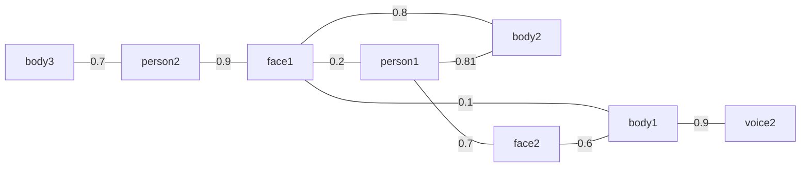
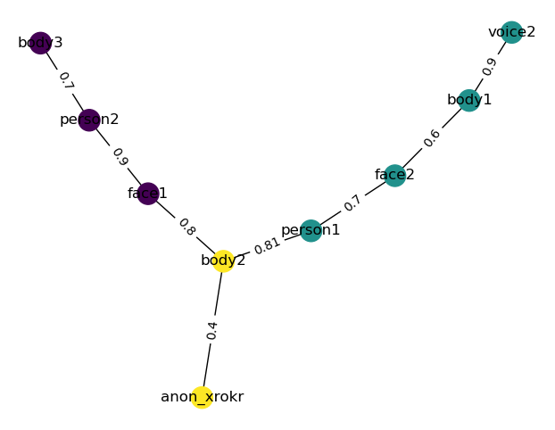
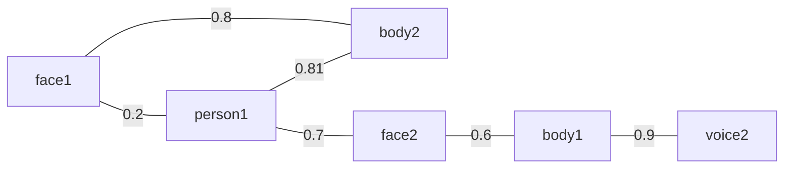
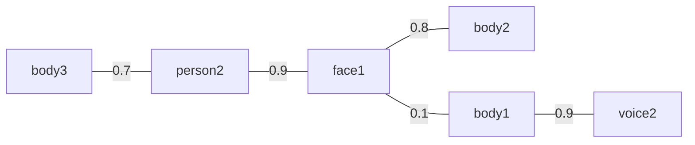
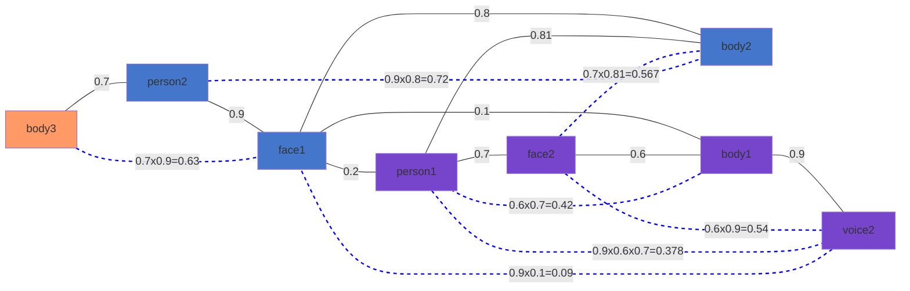
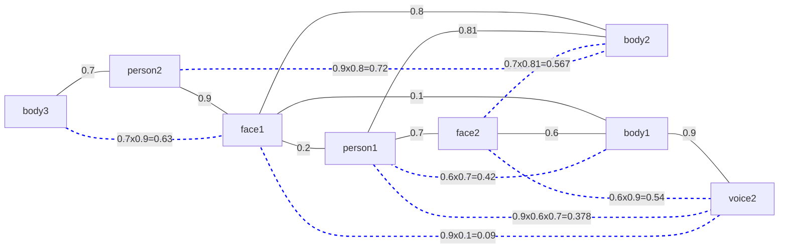

Person matching algorithm
=========================

# Example network



The resulting associations generated by the algorithm described hereafter are:



# Definitions and requirements

**DEFINITION 1**: a *node* is either a feature or a person, and accordingly *node
types* are one of face, body, voice or person.

**DEFINITION 2**: a *feature* is a face, body, or voice. Accordingly, the *feature
type* is one of *face*, *body* or *voice*.

**DEFINITION 3**: *nodes* (eg either persons or features) might be *connected* to
each other if a likelihood of association has been published between them (via
the `/humans/candidate_matches` topic). Together they span a grap called the
*person features graph*.

**DEFINITION 4**: A *permissible path* between two nodes is a path that does not
contain more than one node of each type. The likelihood of that path is the
product of the likelihoods of each connection along that path.

**DEFINITION 5**: Nodes can be *associated* to each other, as long as:
- they are not associated to a node of the same type
- they are associated to at most *one* node of each type
- there exists a permissible path between the two nodes
- the likelihood of the path is above the configured *likelihood threshold*

**DEFINITION 6**: the *person associations total likelihood* of a person is the sum of
the likehoods of the paths connecting the person to each of its features.

**REQUIREMENT 1**: associations between persons and their features must be chosen so
that they maximize the sum of all *person associations total likelihoods*.

**REQUIREMENT 2**: detected features that are not associated to a person
must be associated to temporary 'anonymous' persons.

**REQUIREMENT 3**: if two features are associated (eg a face and a body), they
should also be associated to the same anonymous person.

**REQUIREMENT 4**: at anytime, every features must be associated to exactly one
person (anonymous or not).

**REQUIREMENT 5**: associations coming from indirect paths (eg `A` associated to `C`
because `A` connected to `B` and `B` connected to `C`) should be maintained iff the likelihood of the association between
the two nodes was higher that the likelihood threshold at the point the path was
broken. The likelihood of that association will remain constant until the
association is removed (because one of the two nodes disappeared).


# Algorithms

## Alg.1: Likelihood of a path 

Be $N$ the sequence of nodes leading from the start to the end of the path;
$l_i$ the likelihood of $n_i$ being
connected to $n_(i+1)$.

The likelihood of the sub-path $L_i$ from the start to node $i$ is computed as:

$L_0=l_0$
$L_(i+1)=L_(i) + L_(i) * l_i$

The likelihood of the whole path is therefore:

$L = L_{|N|}$

## Alg.2: Best permissible path

The *best permissible path* between two nodes is computed as follow:

1. find all permissible paths
    1. find all paths between the person and the feature
    1. filter out paths that contains more that at most one node of each feature type
    1. compute the likelihood of each remaining path using Alg.1
1. return the path with the highest likelihood

## Main algorithm

1. for each feature *not yet directly connected to a person*, create a new
   anonymous person and connect that anonymous person to the feature with a likelihood equal to
   the likelihood threshold.
1. for each person, compute all permissible person <-> features associations:
    1. for each of the existing {face|body|voice} features, calculate the best
       permissible path between the person and the feature
    1. compute the set of combinations of permissible path for each features,
       **also including the possible absence of a given feature** in the
       association. For
       instance: if there exists paths to two faces and two bodies, generate the
       set of the four possible combinations of faces/bodies as well as the
       possibilities to have only one face and no associated body, or one body and
       no associated face. Thus, it would generate 8 possible combinations.
    1. filter out combinations that are not possible: the graph spanned by the
       selected features when connected to the person can not contain more than
       one node of each node type
    1. for each remaining valid combination, compute the total likelihood by
       summing the likelihoods of each features
1. maximize the overall likelihood of associations across persons
    1. generate the set of combinations of permissible associations across persons
    1. filter out combinations that would result in a feature being associated to
       more that one person
    1. calculate the overall likelihood by summing across all persons their
       associations likelihood
    1. return the highest one
1. for each resulting association, add a direct connection between the person
   and each of its indirectly connected features iff the likelihood of that
   connection is above the threshold (the likelihood being equal to the product
   of the likelihoods along the path).

# Details

## Maximization of overall associations likelihoods

Let's consider the possible associations of `person1` and `person2` in the above
graph, displaying only the *permissible paths* between both persons and the
features:

`person1`:



`person2`:




`person1` could be associated to:

```
Option 1.A: face2 (0.7), body1 (0.7x0.6=0.42), voice2 (0.7x0.7x0.9=0.378) -> total: 0.7+0.42+0.378=1.498
Option 1.B: body2 (0.81), face1 (0.81x0.8=0.648) -> total: 1.458
Option 1.C: body2 (0.81), face2 (0.7) -> total: 1.458
```

`person2` could be associated to:

```
Option 2.A: body3 (0.7) -> total: 0.7
Option 2.B: face1 (0.9), body2 (0.9x0.8=0.72) -> total: 1.62
Option 2.C: face1 (0.9), body1 (0.9x0.1=0.09), voice2 (0.9x0.1x0.9=0.081) -> total: 1.071
```

Options 1.A is mutually exclusive with 2.C (as they both use `body1`); option
1.B is mutually exclusive with 2.B and 2.C (because of `face1`).

The only possible combinations are:
- 1.A and 2.A (sum of likelihoods: 2.198)
- 1.A and 2.B (3.118)
- 1.B and 2.A (2.158)

1.A and 2.B maximise the sum of likelihoods, and lead to the following associations:


# Case study

## Connected graph

The following graph extends the graph above with all possible computed relation
likelihood.

The algorithm is as follow:

```
def find_path(n1, n2):

  return the shortest path (taking into account edge weights) between n1 and n2
  in the graph so that none of the visited nodes are of type n1.type, n2.type or
  the type of any node already visited.

likelihood: set[pair<node>]
for n in nodes:
  for n' in (nodes - n):
    path = find_path(n, n')
    if path.empty:
      likelihood[{n,n'}] = 0
    else:
      likelihood[{n,n'}] = 1

      for l in path.edges:
        likelihood[{n,n'}] *= l
    

```


## Chain consistency

Let's consider the possible associations of `person1`:

`person1`:


In principle, `person1` could be associated to either `face1` or `face2`, and
`body1` or `body2`.


However, to ensure *chain consistency*, `face2` and `body2` can *not* be
selected together, as they are not connected

