Notes:

- anonymous nodes must start with `anon`
- the main graph is kept and updated across tests, unless a line 'RESET GRAPH'
  is found

THRESHOLD: 0.4

# Step 1: one independent feature

## INPUT

```
face1
```
## GRAPH


## OUTPUT

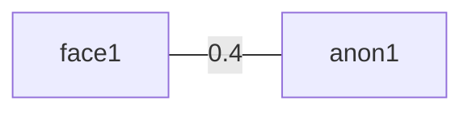

# Step 2: two independent features

## INPUT

```
body1
```

## GRAPH

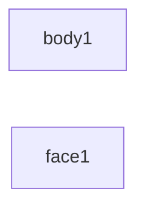

## OUTPUT

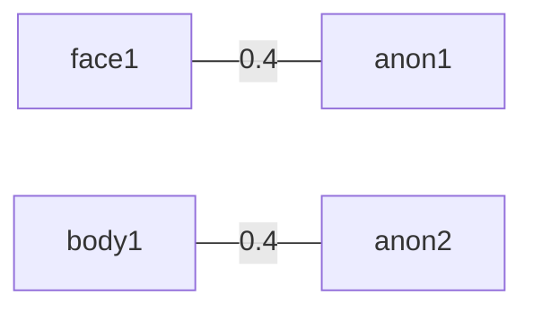

# Step 3: association between these features -- one anonymous person should disappear

## INPUT

```
face1,body1,0.6
```

## GRAPH

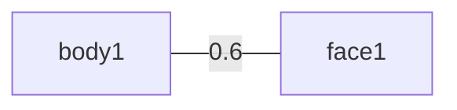

## OUTPUT

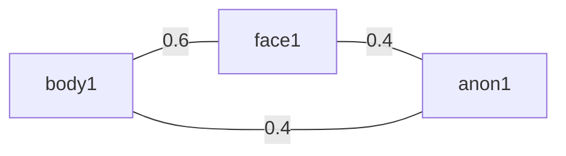

# Step 4: feature removed

## INPUT

```
-face1
```

## GRAPH


## OUTPUT


# Step 5: new face associated to person

## INPUT

```
face2,person1,0.7
```

## GRAPH

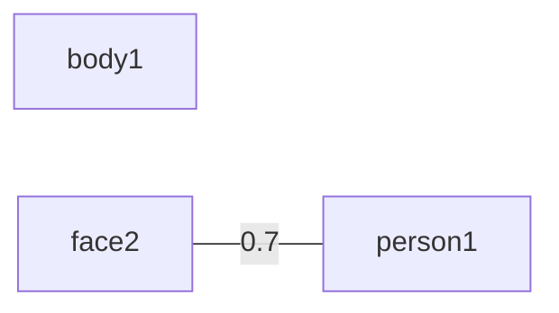

## OUTPUT

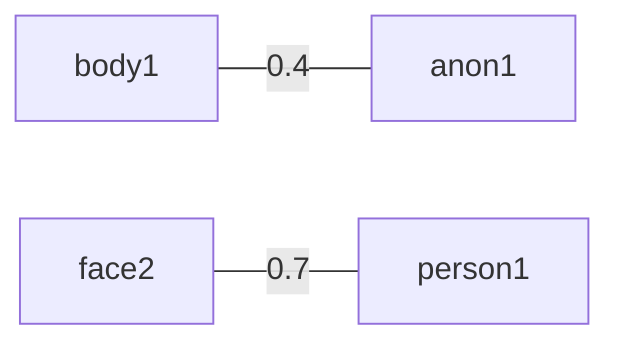

# Step 6: adding feature to person via link

## INPUT

```
face2,body1,0.8
```

## GRAPH

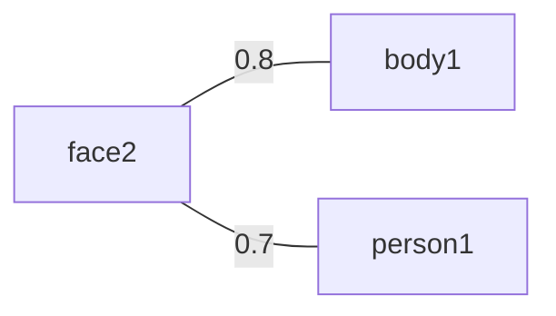

## OUTPUT

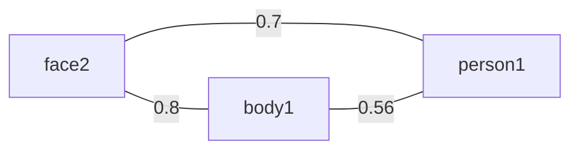

# Step 7: ensure stable association

## INPUT

```
-face2
```

## GRAPH


## OUTPUT


# Step 8: update computed association

## INPUT

```
face3,body1,0.8
face3,person1,0.6
```

## GRAPH

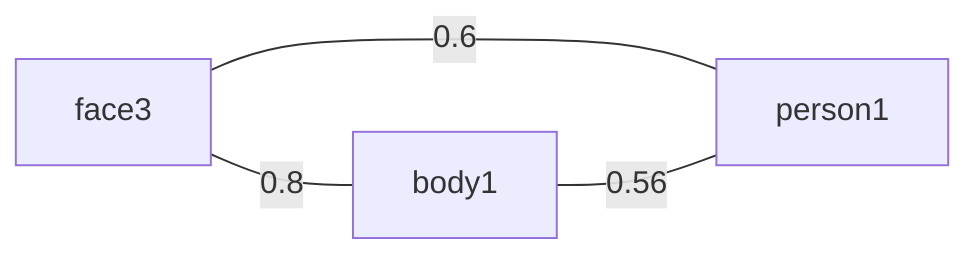

## OUTPUT


# Step 9: new face

## INPUT

```
face4
```

## GRAPH

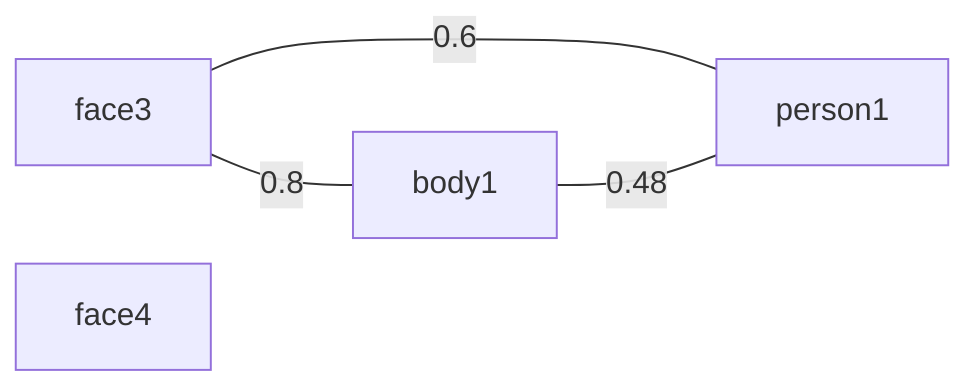

## OUTPUT

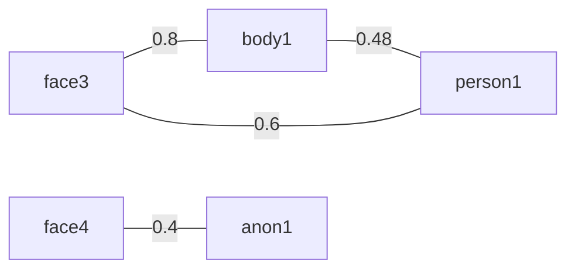

# Step 10: new face being recognised

## INPUT

```
face4,person1,0.5
face4,person2,0.56
face4,person3,0.61
```

## GRAPH

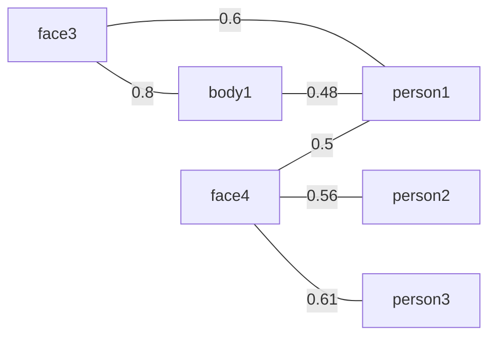

## OUTPUT

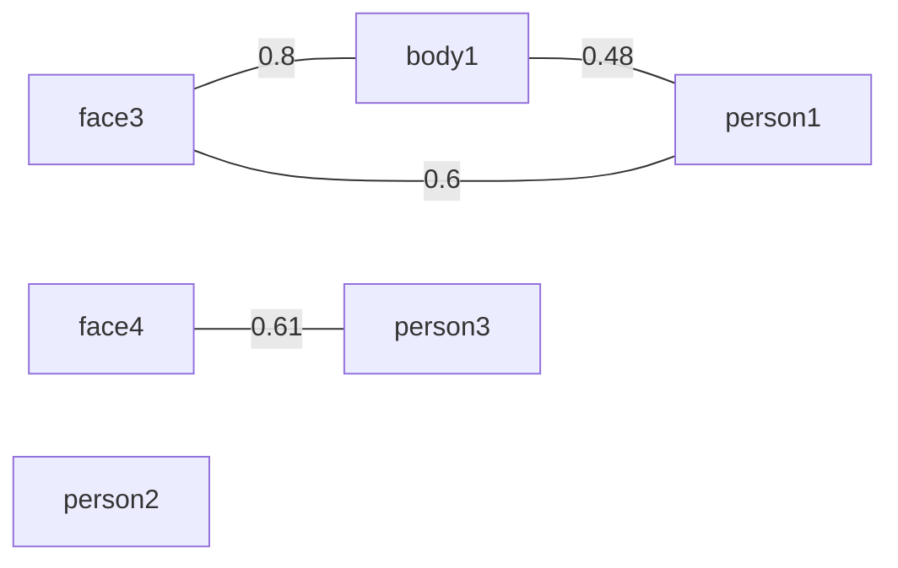

# Step 11: first face recognition results updated

## INPUT

```
face3,person1,0.53
face3,person2,0.56
face3,person3,0.2
```

## GRAPH

``` mermaid
graph LR

face3 ---|0.8| body1
body1 ---|0.48| person1
face4 ---|0.5| person1

face4 ---|0.56| person2
face4 ---|0.61| person3

face3 ---|0.53| person1
face3 ---|0.56| person2
face3 ---|0.2| person3
```

## OUTPUT

``` mermaid
graph LR

face3 ---|0.8| body1
face3 ---|0.56| person2
person2 ---|0.448| body1

face4 ---|0.61| person3

person1
```
%%%%%%%%%%%%%%%%%%%%%%%%%%%%%%%%%%%%%%%%%%%%%%%%%%%%%%%%%%%%%
%%%%%%%%%%%%%%%%%%%%%%%%%%%%%%%%%%%%%%%%%%%%%%%%%%%%%%%%%%%%%
%%%%%%%%%%%%%%%%%%%%%%%%%%%%%%%%%%%%%%%%%%%%%%%%%%%%%%%%%%%%%

RESET GRAPH

# Lorenzo's not-so-tricky case

## INPUT

```
v1,f1,0.99
f1,p1,0.6
f2,p1,0.99
```

## GRAPH

```mermaid
v1 ---|0.99| f1
f1 ---|0.6| p1
f2 ---|0.99| p1
```

## OUTPUT

```mermaid
v1 ---|0.99| f1
f1 ---|0.4| anon1
v1 ---|0.4| anon1

f2 ---|0.99| p1
```


%%%%%%%%%%%%%%%%%%%%%%%%%%%%%%%%%%%%%%%%%%%%%%%%%%%%%%%%%%%%%
%%%%%%%%%%%%%%%%%%%%%%%%%%%%%%%%%%%%%%%%%%%%%%%%%%%%%%%%%%%%%
%%%%%%%%%%%%%%%%%%%%%%%%%%%%%%%%%%%%%%%%%%%%%%%%%%%%%%%%%%%%%

RESET GRAPH

# Real-world case

## INPUT

```
f1,p1,0.8
f1,p2,0.7
f1,p3,0.5
f2,p4,0.8
f2,p2,0.65
b1,f1,0.8
b1,f2,0.75
b2,f2,0.7
b2,f1,0.65
v1,f1,0.6
v1,f2,0.58
v3,f1,0.2
v3,f2,0.21
```

## GRAPH

``` mermaid
graph LR

f1 ---|0.8| p1
f1 ---|0.7| p2
f1 ---|0.5| p3
f2 ---|0.8| p4
f2 ---|0.65| p2
b1 ---|0.8| f1
b1 ---|0.75| f2
b2 ---|0.7| f2
b2 ---|0.65| f1
v1 ---|0.6| f1
v1 ---|0.58| f2
v3 ---|0.2| f1
v3 ---|0.21| f2
```

## OUTPUT

``` mermaid
graph LR

f1 ---|0.8| p1
b1 ---|0.8| f1
v1 ---|0.6| f1
%% automatically computed
v1 ---|0.48| p1
b1 ---|0.64| p1

f2 ---|0.8| p4
b2 ---|0.7| f2
%% automatically computed
b2 ---|0.56| p4

p2
p3
v3 ---|0.4| anon2
```


# Real-world case: face disappears

## INPUT

```
-f1
```

## GRAPH

``` mermaid
graph LR

f2 ---|0.8| p4
f2 ---|0.65| p2
b1 ---|0.75| f2
b2 ---|0.7| f2
v1 ---|0.58| f2

%% automatically computed
v1 ---|0.48| p1
b1 ---|0.64| p1
b2 ---|0.56| p4

p3
v3
```

## OUTPUT

``` mermaid
graph LR

b1 ---|0.64| p1

v1 ---|0.58| f2
v1 ---|0.464| p4
f2 ---|0.8| p4
b2 ---|0.7| f2
b2 ---|0.56| p4

p2
p3
v3 ---|0.4| anon2
```


%%%%%%%%%%%%%%%%%%%%%%%%%%%%%%%%%%%%%%%%%%%%%%%%%%%%%%%%%%%%%
%%%%%%%%%%%%%%%%%%%%%%%%%%%%%%%%%%%%%%%%%%%%%%%%%%%%%%%%%%%%%
%%%%%%%%%%%%%%%%%%%%%%%%%%%%%%%%%%%%%%%%%%%%%%%%%%%%%%%%%%%%%

RESET GRAPH

# Step n

## INPUT

```
body3,person2,0.7
person2,face1,0.9
face1,body2,0.8
face1,person1,0.2
face1,body1,0.1
person1,face2,0.7
person1,body2,0.81
body1,voice2,0.9
face2,body1,0.6
voice3,body3,0.5
voice1,body2,0.5
```

## GRAPH

``` mermaid
graph LR

body3 ---|0.7| person2
person2 ---|0.9| face1
face1 ---|0.8| body2
face1 ---|0.2| person1
face1 ---|0.1| body1
person1 ---|0.7| face2
person1 ---|0.81| body2
body1 ---|0.9| voice2
face2 ---|0.6| body1
voice3 ---|0.5| body3
voice1 ---|0.5| body2
```

## OUTPUT

``` mermaid
graph LR

body3 ---|0.7| person2
person2 ---|0.9| face1
voice3 ---|0.5| body3


anon3 ---|0.4| body1
body1 ---|0.9| voice2
voice2 ---|0.4| anon3

body2 ---|0.81| person1
voice1 ---|0.5| body2
person1 ---|0.7| face2
person1 ---|0.405| voice1
```

# Step 2: body2 disappears

## INPUT

```
-body2
```

## GRAPH
``` mermaid
graph LR

body3 ---|0.7| person2
person2 ---|0.9| face1
person1 ---|0.7| face2
person1 ---|0.405| voice1
body1 ---|0.9| voice2
face2 ---|0.6| body1
voice3 ---|0.5| body3
```

## OUTPUT

``` mermaid
graph LR

voice1 ---|0.4| anon3

body3 ---|0.7| person2
person2 ---|0.9| face1
voice3 ---|0.5| body3
%% note: no direct connection between person2 and voice3 as likelihood below
%% threshold


face2 ---|0.7| person1
voice2 ---|0.9| body1
body1 ---|0.6| face2
body1 ---|0.42| person1
%% note: no direct connection between person1 and voice2 as likelihood below
%% threshold

```

# Step 3: body4 appears, associated to voice1

## INPUT

```
body4,voice1,0.6
```

## GRAPH
``` mermaid
graph LR

body3 ---|0.7| person2
person2 ---|0.9| face1
person1 ---|0.7| face2
person1 ---|0.405| voice1
body1 ---|0.9| voice2
body1 ---|0.42| person1
face2 ---|0.6| body1
voice3 ---|0.5| body3
voice1 ---|0.6| body4
```

## OUTPUT

``` mermaid
graph LR

%% body4 should be connected to existing anon3
voice1 ---|0.4| anon3
body4 ---|0.4| anon3
voice1 ---|0.6| body4

body3 ---|0.7| person2
person2 ---|0.9| face1
voice3 ---|0.5| body3


face2 ---|0.7| person1
voice2 ---|0.9| body1
body1 ---|0.6| face2
body1 ---|0.42| person1
```

RESET GRAPH
